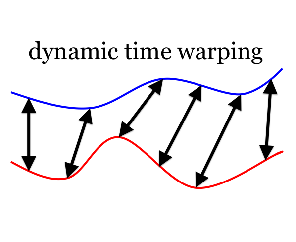

# Dynamic Time Warping (DTW) [](https://www.mathworks.com/matlabcentral/fileexchange/43156-dynamic-time-warping-dtw) [](https://github.com/wq2012/dynamic_time_warping/actions/workflows/octave.yml)

DTW is implemented in both MATLAB/Octave and C/MEX. The C/MEX function is very fast.

The algorithm we use is the standard one from Wikipedia:
* http://en.wikipedia.org/wiki/Dynamic_time_warping

There is a demo in the package. To use, just call:
```
d=dtw(s,t,w)
```
or
```
d=dtw_c(s,t,w)
```

This library is also available on MathWorks MATLAB Central:
* https://www.mathworks.com/matlabcentral/fileexchange/43156-dynamic-time-warping-dtw

